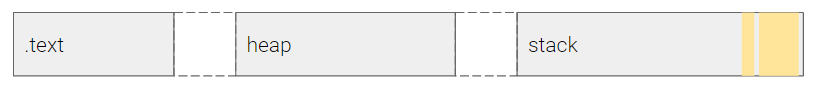
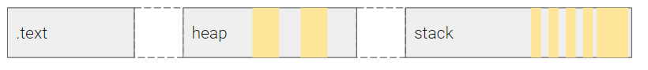
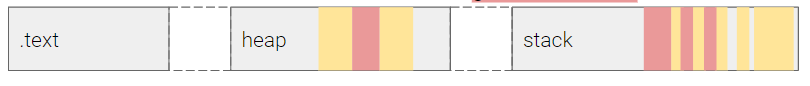

In the early days of computing, programmers would write machine code by hand, using a series of switches or a punched card or paper tape to represent the ones and zeros. This was a time-consuming and error-prone process, and it required a deep understanding of the underlying hardware and architecture of the computer.

Over time, higher-level programming languages were developed that allowed programmers to write code in a more abstract, human-readable form. These languages are translated into machine code by a compiler or interpreter before they can be run on a computer.

Dennis Ritchie developed C in 1972 with the goal of creating a programming language that was portable across different computer architectures and provided developers with low-level control over memory access. C is known for its close mapping to assembly language and its ability to effectively execute without many runtime surprises.

### Memory Corruptions

Memory corruption occurs when a program writes data to memory in an unintended way, often resulting in errors or vulnerabilities in the system. The idea of memory isolation between processes, as proposed by Graham et al., was an important step in addressing these concerns by limiting the ability of one process to access or modify the memory of another process. This helps to prevent malicious or poorly written programs from causing unintended consequences on the system. Memory isolation is an important concept in modern operating systems and is used to improve security and prevent data corruption.

### Problems with C


##### Trusting the Developers

_In Python_:

```python
a = [ 1, 2, 3 ]
print a[10] = 0x41;
#IndexError: list index out of range
```

_In C_:

```c
int a[3] = { 1, 2, 3 };
 a[10] = 0x41;
  // no problem!
```

In the Python code snippet, when the developer attempts to access the 11th element in the list `a` using the index `10`, they receive an `IndexError` because the list only has 3 elements and the index is out of range. This is a built-in safety mechanism in Python that prevents developers from accidentally accessing or modifying elements that do not exist in the list.

On the other hand, in the C code snippet, the developer is able to assign the value `0x41` to the 11th element of the array `a` without any error or exception being thrown. This is because C does not have built-in bounds checking for arrays, and the developer is responsible for ensuring that they do not access or modify elements that are out of range.

If the developer attempts to access or modify an element that is out of range in C, the program will continue to execute and the result will depend on the specific behavior of the underlying hardware and operating system. This can lead to unpredictable or unintended consequences, such as data corruption or a crash.

Therefore, one issue with using C is that developers must be careful to ensure that they do not access or modify elements that are out of range, as there is no built-in protection against this type of error. In contrast, languages like Python provide built-in mechanisms to prevent such errors and protect against memory corruption.

#### Mixing the Control Information with User Data.

 

When a program starts up, it may have data that has been influenced by the user already present. This data may come from a variety of sources, such as user input, configuration files, or command line arguments. This user-influenced data is often stored in variables and used by the program during execution.



As the program executes, this user data can spread throughout the program and be used in various parts of the code. However, it is important to ensure that user data does not directly control program execution. This is because user data is considered "non-control" data and should not be used to determine the flow of the program.



However, user data is often stored in the same memory as "control" data, which is data that determines the flow of the program. This can create vulnerabilities if the user data is not properly validated or sanitized before being used. For example, if user data is used to determine the size of an array, an attacker could potentially manipulate the user data to create a buffer overflow or other type of memory corruption.

To prevent these types of vulnerabilities, it is important to properly validate and sanitize user data before using it in the program and to carefully separate control data from non-control data in memory.




In C, the stack is a region of memory that stores various types of data related to the current function and its calling functions. This data can include local variables, pointers to other locations in the stack or in memory, and pointers to code (return addresses). All of this data is stored together in the stack and treated in the same way. If a user is able to overwrite control data, such as a return address, they can use this to redirect the control flow of the program elsewhere or on the stack containing our shellcode.

```c
int a[3] = { 1, 2, 3 };
a[10] = 0x41;
```

For example, in the C code snippet provided, the array `a` and its elements are stored on the stack along with other data, such as local variables and pointers. When the developer attempts to assign the value `0x41` to the 11th element of the array `a`, this operation is performed on the stack without any bounds checking. As a result, it is possible for the developer to access or modify elements that are out of range, which can lead to unpredictable or unintended consequences.

#### Mixing Data with Meta Data

 

In C, strings are typically represented as arrays of characters that are terminated with a NULL byte. For example, the code snippet declares a character array `name` of size 10 and initializes it with the string "Yan". This means that the `name` array will hold 10 bytes in memory, with the first 3 bytes containing the characters 'Y', 'a', and 'n', and the remaining 7 bytes initialized to NULL. The NULL byte at the end of the string serves as a terminator and implicitly encodes the length of the string data.

```c
char name[10] = "Yan";
read(0, name, sizeof(name));
```

If the `read` function is called with the third argument being `sizeof(name)`, it will read up to 10 bytes from the input and store them in the `name` array. If there are NULL bytes in the input, they will be stored in the `name` array along with the other characters and will not terminate the string.

On the other hand, if there are no NULL bytes in the input, the `read` function will continue to read and store characters until it reaches the end of the input or the maximum number of bytes specified (in this case, 10). If the input is longer than 10 bytes, the `read` function will start storing characters starting from the address where the name is stored in memory and eventually overwrite the NULL byte required in string by C standards.

#### Cleanup Problem

 

In C, it is the responsibility of the developer to manage memory and other resources during the execution of a program. This includes properly initializing and releasing resources to prevent resource leaks. If these tasks are not performed correctly, the program may suffer from performance degradation or even failure.

```c
void my_function()  
{
	char my_variable[8];
}
// what is the value of my_variable here?
```
For example, in the code snippet provided, the variable `my_variable` is declared as an array of characters with size 8. However, the value of `my_variable` is not initialized at the time it is declared. This means that the contents of the `my_variable` array are undefined and may contain any values. It is the responsibility of the developer to initialize the `my_variable` array to a known state before using it in the program.
In general, it is important to carefully consider resource management in C and to properly initialize and release resources to prevent resource leaks and ensure the proper functioning of the program.

### Causes of Corruption
 

#### Classic Bufferoverflow

In the C programming language, the programmer is responsible for managing the size of buffers, which are blocks of memory used to store data. This means that it is up to the programmer to ensure that the amount of data written to a buffer does not exceed its capacity. If a buffer is not large enough to hold the data being written to it, the data may overwrite adjacent memory, potentially leading to unpredictable behavior or even a crash.

```c
int main(int argc, char **argv, char **envp) { char small_buffer[16]; read(0, small_buffer, 128); }
```

In the example provided, the small_buffer array has a size of 16 bytes. However, the read function is attempting to read in 128 bytes of data from the standard input stream into this buffer. Since the small_buffer array is not large enough to hold this much data, any data beyond the 16th byte will overwrite other memory. This can lead to problems if the overwritten memory is being used by the program for some other purpose.

To avoid this issue, the programmer should ensure that the size of the buffer is sufficient to hold the data being written to it. In this case, the small_buffer array should be at least 128 bytes in size to safely hold the data being read from the input stream.

#### Signedness Mixup

```c
int main() 
{

int size;

  char buf[16];

  scanf("%i", &size);

  if (size > 16) exit(1);

  read(0, buf, size);

  }
```

In the example provided, the size variable is an integer, which is a signed type in the C programming language. However, the read function and other similar functions in the standard C library use unsigned integers for sizes. This means that if size is a negative value, it will be treated as a large positive value when passed as an argument to these functions.

This can lead to problems if the value of size is intended to be used as a limit on the amount of data being read or copied. For example, if size is negative, the read function will attempt to read a large amount of data into the buf array, potentially causing a buffer overflow or other unexpected behavior.

To avoid this issue, the programmer should ensure that size is a non-negative value before calling functions that expect unsigned integer sizes. In this case, the code could include a check to ensure that size is greater than or equal to zero before calling the read function. Alternatively, the size variable could be defined as an unsigned integer to match the expected type of the read function.

### Stack Canaries

Buffer overflows occur when a program attempts to write more data to a buffer than it can hold, causing the excess data to overwrite adjacent memory locations. One type of buffer overflow attack involves overwriting the return address of a function on the call stack, which can allow an attacker to execute arbitrary code or gain unauthorized access to a system.

To defend against this type of attack, researchers introduced a technique known as stack canaries. A stack canary is a random value that is placed at the end of the stack frame for a function before the function is called. When the function returns, the value of the stack canary is checked to ensure that it has not been modified. If the stack canary has been modified, it is likely that a buffer overflow has occurred, and the program can terminate or take other appropriate action.

The use of stack canaries can help to prevent buffer overflow attacks by making it more difficult for an attacker to control the return address of a function. However, it is important to note that stack canaries can be bypassed in some cases, and they should not be relied upon as the sole means of defense against buffer overflow attacks. Other techniques, such as stack protection and address space layout randomization, may also be used to enhance security.

Here is Example:

```bash
   0x0000000000001175 <+0>:     push   rbp
   0x0000000000001176 <+1>:     mov    rbp,rsp
   0x0000000000001179 <+4>:     add    rsp,0xffffffffffffff80
   0x000000000000117d <+8>:     mov    DWORD PTR [rbp-0x74],edi
   0x0000000000001180 <+11>:    mov    QWORD PTR [rbp-0x80],rsi
   0x0000000000001184 <+15>:    mov    rax,QWORD PTR fs:0x28 /*canary... fetch*/
   0x000000000000118d <+24>:    mov    QWORD PTR [rbp-0x8],rax/*saving canary on stack*/
   0x0000000000001191 <+28>:    xor    eax,eax
   0x0000000000001193 <+30>:    mov    eax,0x0
   0x0000000000001198 <+35>:    call   0x1139 <fun>
   0x000000000000119d <+40>:    mov    eax,0x0
   0x00000000000011a2 <+45>:    mov    rdx,QWORD PTR [rbp-0x8]
   0x00000000000011a6 <+49>:    sub    rdx,QWORD PTR fs:0x28/*checking canary*/
   0x00000000000011af <+58>:    je     0x11b6 <main+65>
   0x00000000000011b1 <+60>:    call   0x1030 <__stack_chk_fail@plt>/*if failed*/
   0x00000000000011b6 <+65>:    leave
   0x00000000000011b7 <+66>:    ret
```


##### By-Passing the canary.

There are several methods that can be used to bypass stack canaries in certain situations. One method is to use another vulnerability in the program to leak the value of the stack canary. This can allow an attacker to determine the value of the canary and use it to construct a buffer overflow attack that bypasses the canary check.

Another method is to brute-force the canary by forking processes repeatedly until the correct value is found. This can be done by repeatedly calling the fork function, which creates a copy of the current process, and waiting for the child process to return. If the child process returns successfully, it means that the canary has not been modified and the value can be determined.

A third method is to jump the canary by overwriting the value of a variable in the stack frame and redirecting the flow of execution to a location after the canary. This can be done if the layout of the stack allows the value of the variable to be controlled by an attacker.

It is important to note that stack canaries are an effective security mechanism in general, but they can be bypassed in certain situations. Other techniques, such as stack protection and address space layout randomization, may also be used to enhance security.

#### Address Space Layout Randomization

ASLR is a security mechanism that randomizes the locations of code and data in memory, making it more difficult for an attacker to predict the location of specific pointers or other data in memory.

With ASLR, an attacker who corrupts a pointer may not be able to predict where it will point, making it more difficult to successfully execute an attack. For example, if the attacker corrupts a pointer to point to malicious code, the code may not be located at the expected address due to ASLR, and the attack will fail.

Overall, ASLR can help to increase the security of a system by making it more difficult for attackers to successfully execute memory corruption attacks. However, it is important to note that ASLR is not a foolproof defense, and it should be used in conjunction with other security measures to provide the best protection against memory corruption attacks.

There are several methods that can be used to bypass ASLR in certain situations.

One method is to leak the addresses of program assets, such as code or data, out of the program. This can be done by using another vulnerability in the program to disclose the addresses, such as a buffer overflow or information leakage vulnerability. While ASLR can make it more difficult for an attacker to predict the location of specific assets, the assets still have to be in memory in order for the program to access them. Therefore, an attacker who is able to leak the addresses of assets can use this information to construct a successful memory corruption attack.

Another method is to overwrite just the page offset of program assets. Program assets are typically page-aligned in memory, meaning that they are located at addresses that are multiples of the page size. By overwriting the page offset, an attacker can potentially redirect the flow of execution to a different asset that is located on the same page. This method may require some brute-forcing to find the correct page offset.

A third method is to brute-force the addresses of program assets by forking processes repeatedly and checking the location of assets in each child process. This can be done by repeatedly calling the fork function, which creates a copy of the current process, and examining the location of assets in each child process. While this method may be effective in some cases, it can be time-consuming and may not be practical for larger programs with many assets.

Overall, ASLR is an effective security mechanism for defending against memory corruption attacks, but it can be bypassed in certain situations. It is important to use a combination of security measures to provide the best protection against these types of attacks.

##### Page-Alignment

In computer systems, memory is typically divided into pages, which are blocks of contiguous memory that are typically 4,096 bytes (0x1000) in size. Pages are typically aligned to addresses that are multiples of the page size, meaning that the least significant bits of the address are always zero.

For example, if a page is 4,096 bytes in size, its possible addresses would be 0x0000, 0x1000, 0x2000, and so on. This means that the last three nibbles (4 bits) of an address are never changed, and the only variable portion of the address is the first nibble.

If an attacker wants to redirect a pointer to another location on the same page, they can overwrite the two least significant bytes of the pointer. With little endian byte ordering, these are the first two bytes of the pointer. By overwriting these two bytes, the attacker can redirect the pointer to any address within the same page, requiring only a brute-force search of 16 possible values (one nibble) to find a valid address.

It is important to note that this method of bypassing ASLR is only effective if the attacker can control the two least significant bytes of a pointer. In other cases, a more extensive brute-force search may be required to find a valid address. Additionally, this method may not be effective if the target program uses other security measures, such as stack canaries or non-executable stacks, to defend against memory corruption attacks.

> 💡 **Note:**
>The Brute-Force technique works in netwrok based application and it can work in android since all the processes in android are spawned throug the single main process

Further Reading : 
- https://www.mdpi.com/2076-3417/12/13/6702
- Read About [[3. Shellcode Injection]] to overwrite the return address after bypassing these mitigation techniques
