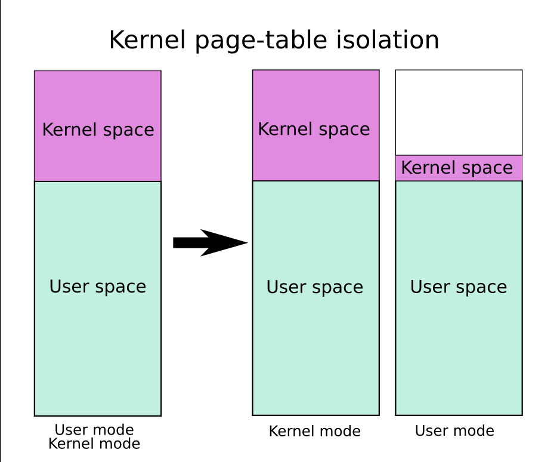

### KPTI
KPTI stands for Kernel Page Table Isolation. It is a security feature in modern operating systems that is used to protect against a type of attack known as a "meltdown" in which an attacker can potentially access sensitive information in a computer's memory. It works by isolating the kernel's memory space from the user's memory space, making it more difficult for an attacker to access sensitive information.

### Meltdown Attack

Meltdown is a type of attack that exploits a vulnerability in modern computer processors. The attack allows a malicious program to bypass the system's memory isolation mechanisms and access sensitive information, such as passwords, encryption keys, and other sensitive data, that are stored in the memory of other running programs. This is possible because of a design feature called speculative execution, in which modern processors try to anticipate the next instruction to be executed and start executing it before it is confirmed. This improves performance but also allows a malicious program to access data from the memory of other programs, even if it should not have permission to do so. Meltdown affects mainly Intel processors, and affects all operating systems, including Windows, Linux and macOS. This vulnerability was disclosed in January 2018 and was given the **CVE-2017-5754** identification number.

Further Read for the Meltdown : https://meltdownattack.com/

##### How KPTI is Working ?

In a normal operation, the kernel and user-level programs share the same memory space, which allows for better performance, but also makes it easier for a malicious program to access sensitive information in the kernel's memory.

**Read Further about Process address space and Virtual Memory Mapping**
- [1. Process in Linux](1.%20Process%20in%20Linux.md)
- [1. Kernel Security](1.%20Kernel%20Security.md)
  
In KPTI, there are two sets of page tables, one for user-mode and one for kernel-mode. These two sets of page tables are used to map the virtual memory addresses to physical memory addresses. The kernel-mode page table has full access to both kernel and user memory, while the user-mode page table has limited access to the kernel memory. In order to achieve this, the kernel pages are marked as non-executable in user copy.

In the Intel processor, the MMU (Memory Management Unit) uses a register called CR3 (Control Register 3) to store the physical address of the page directory. When a process switches between user and kernel mode, the Linux kernel updates the value of the CR3 register to point to the appropriate page directory for the current mode.

In Linux kernel, the page directory for each process is stored in a data structure called `mm_struct`. The `mm_struct` data structure contains a field called `pgd` that stores the physical address of the page directory for the process.

> 💡 **Note:**
>`task_struct` contains `mm_struct` so order is `task_struct->mm_struct->pgd`

When a process switches from user mode to kernel mode, the Linux kernel saves the current value of the CR3 register in a temporary variable, then it updates the value of the CR3 register with the physical address of the kernel page directory this can be done easily since both tables are placed next to each other in memory.

On the other hand, when a process switches from kernel mode to user mode, the Linux kernel restores the value of the CR3 register with the physical address of the page directory for the current process, which is stored in the `pgd` field of the `mm_struct` data structure associated with the process.

Further Reading : [Page Table Management (kernel.org)](https://www.kernel.org/doc/gorman/html/understand/understand006.html)
